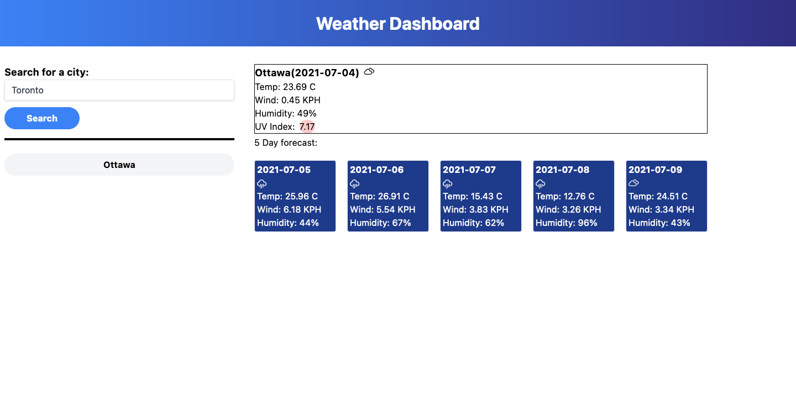
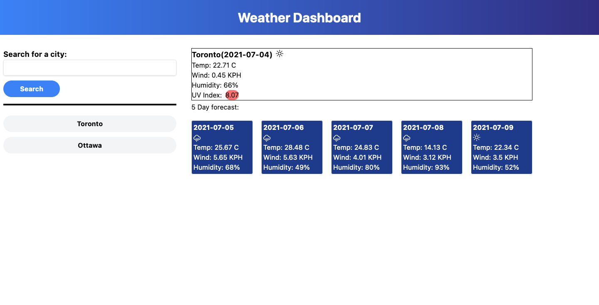
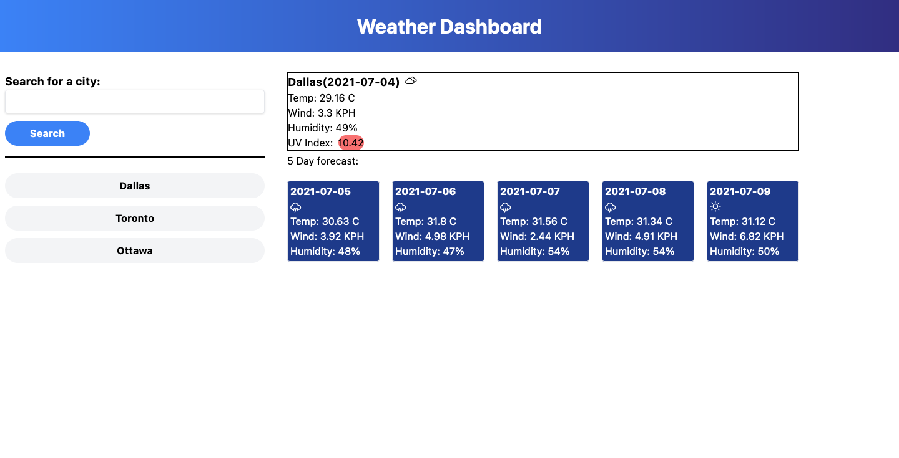
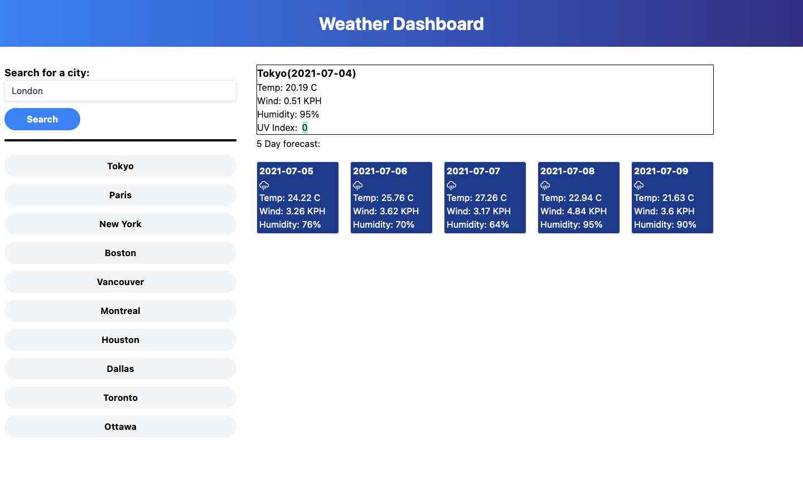

# weatherdashboard
Challenge 6 - Description: 
This challenge involves building a weather dashboard. On this page you can search for any city in the world and it will display
the current weather, as well as weather for the next 5 days. The weather conditions are communicated through icons and the coloured
background for the UV index will indicate the severity of the UV index. 

Once a user searches for a city, that city is saved to their search history(in local storage) for upto a maximum of 10 entries. When
the user reloads the webpage, their search history will repopulate.

Screenshot: 

URL: https://askarrizvi.github.io/weatherdashboard/
